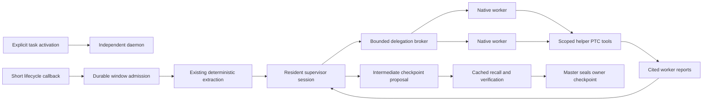

> Package reference from `docs/agent-supervisor-plan.md`. Run repository-relative examples from a selected source or release directory; installed CLI commands use the installed executable.

# Bounded agent supervisor loop

This is the implementation contract for the agent capability surface. It extends
the deterministic recorder without changing the existing prepared-input,
text-only `runAppServerTask` API. An interface or a passing transport probe alone
does not establish the acceptance cases below.

## Useful first outcome

A master explicitly activates a task binding. Short native lifecycle callbacks
admit source windows into the existing SQLite queue. The independently owned
daemon extracts those windows, then a native Codex supervisor delegates bounded
work to native Codex workers. Workers use scoped helper tools. The supervisor
reduces their cited findings into an intermediate checkpoint proposal that can be
queried, resolved and recalled by the master. The master retains responsibility
for sealing the formal owner checkpoint and `task_turns_checkpoint` event.

The initial loop admits one fan-out per window round. The supervisor chooses the
assignments and their selected record handles; the host validates the scope,
reserves budgets and schedules concurrency. It may choose fewer workers than the
configured ceiling. A worker cannot delegate or activate another recorder.

## Ownership and lifetime

- The existing `Store`, extraction jobs, immutable records and source cursors
  retain their current semantics. A separate supervisor store owns `agent_*`
  tables in the same private SQLite database. Only an explicit initialization or
  activation operation creates these tables.
- Activation binds a master binding, policy digest, model selection, budgets and
  optional prepared artifacts. Binding alone does not authorize a model call.
  Deactivation revokes new admissions and aborts work owned by that activation.
- A resident supervisor session owns one App Server process and persisted native
  thread for an activation. Its turns run serially across successive windows.
  Worker sessions may use separate short-lived owned processes and fresh threads;
  this avoids introducing a multiplexing layer for the first implementation.
- The daemon owns process groups, cancellation controllers and heartbeat leases.
  Hooks own neither the model lifetime nor its termination. A Hook may request a
  bounded wake only when a prior activation authorizes that exact service
  configuration. Unbound sessions and observer/worker sessions remain inert.
- An explicit stop interrupts active turns, closes owned processes and verifies
  process-group cleanup before recording successful shutdown. A dead session is
  not transparently replaced while describing the same attempt as successful.

Production defaults are supervisor `gpt-6-sol` / `medium` and worker
`gpt-6-luna` / `medium`. The eval profile is `gpt-6-luna` / `high`. Requested and
observed model/effort values are recorded separately. No unavailable model or
account silently falls back to another route. The dedicated Codex home uses its
own persistent `codex login --device-auth` login; provider API keys are not passed
to native Codex children.

## Native transport seam

The new resident session surface supplies `runTurn` and `close`; a one-shot agent
helper may wrap this surface for workers. It remains separate from the existing
text-only adapter. Every turn returns observed native thread/session/turn IDs,
rollout location verification state, bounded usage and a tool-call receipt list.
Missing native fields remain unavailable rather than being copied from logical
task or worker IDs.

For the inspected Codex 0.158.0 contract, `thread/start.dynamicTools` accepts
function declarations with `name`, `description` and `inputSchema`.
`item/tool/call` carries `threadId`, `turnId`, `callId`, `tool`, optional namespace
and arguments. The host responds to the same RPC request ID with `contentItems`
and `success`. Experimental API capability is explicit. Runtime owners must pin
and test the supported native versions rather than infer compatibility from a
similar version string.

The broker dispatches only registered tools and validates thread, turn, tool,
arguments, byte limits, current lease generation and active binding before each
effect. Duplicate call IDs have one recorded result; conflicting duplicate
arguments fail the attempt. Requests from another thread or a completed turn do
not become a new tool invocation.

The inspected native API has no universal `allowed_tools=[]` capability. Empty
environments and the restricted configuration reduce the available native tools;
the host's broker allowlist is strict. Unexpected native requests or tool activity
make the attempt fail. This detection must not be described as a guarantee that
every possible native utility tool was prevented from running.

## Tool and content contract

The host freezes a ready window only after every selected deterministic
extraction job succeeds. It copies record metadata and source selectors into a
snapshot with a digest. Its scope is exactly one activation, binding, task and
window. Incomplete tails, omitted pages, absent IDs and other coverage limits
remain visible in the snapshot and proposal.

The supervisor receives `tcr_delegate` with an array of unique task keys,
objectives and optional selected record handles. Its implementation reserves the
entire fan-out before launch and returns compact worker reports. The supervisor
then produces a validated reduction in the same native turn. A normal nonempty
round requires at least one delegated worker and a successful helper tool call
from each accepted worker; a prose-only answer cannot satisfy this condition.

Omit `record_handles` to give a worker the current window snapshot. When present,
it must be a nonempty, unique subset of issued handles. An empty, null, duplicate
or foreign selection is rejected before dispatch with a bounded argument hint;
it never expands into the full snapshot. The supervisor prompt includes at most
20 opaque handle-and-kind previews, without source bodies.

Completed PTC tools return a full `evidence_ref` and a shorter `citation_ref`.
Workers may copy the short value into `evidence_refs`; the host resolves it only
when exactly one issued full reference matches within that worker's stored
evidence. The supervisor receives the workers' preferred `citation_refs` and
resolves them within the current run. Unknown or ambiguous aliases are rejected,
and durable reports and proposal deep links retain the full reference. The short
value is a citation aid, not a new evidence source or a wider access grant.

Workers receive these tools through an injected helper adapter:

| Tool | Model-selected arguments | Host-enforced scope |
| --- | --- | --- |
| `tcr_query` | Allowed filters, fields and bounded pagination | Frozen record set only |
| `tcr_get` | Record handle and metadata/prepared-fragment mode | Issued handle and admitted content policy |
| `tcr_context_pack` | Record handles and character budget | Selected records, pair protection and recorded omissions |
| `tcr_score_prepared` | Prepared packet handle | Exact previously admitted packet, provider, digest and one-attempt budget |

The model cannot supply a filesystem path, arbitrary URL, SQL expression,
credential name/value, scoring request body, or a claim that content has been
redacted. Host-only metadata retains the exact source URI, byte offset, length,
digest and JSON pointer. Model-facing handles resolve only through that frozen
snapshot. A source body is verified against its original selected bytes before
use; a metadata match is not proof that the body was read.

The default native content policy is metadata. Prepared fragments have an
explicit synthetic/redacted class, content digest and host admission reference.
Owner-selected RAW transport is not supported by the current CLI. Any later
capability would need exact records, native destination and separate admission;
source content cannot be automatically labelled redacted. A requirement that real
RAW remain local excludes that capability.

External Jev scoring is a separate capability. A host prepares and admits a
synthetic or deliberately redacted packet, then the worker may select its opaque
packet handle. The packet contains its exact provider/model and request digest.
The broker durably reserves its single attempt before transport. A retry requires
a newly admitted attempt and retains the prior result. No prepared packet means
the scoring tool is absent. Helper pattern redaction is not a sanitization
attestation and never admits an external packet by itself.

## Budgets, leases and recovery

Budget limits belong to activation state and are enforced by the host before an
effect. Worker concurrency defaults to two and has a hard ceiling of 32. Total
workers, model turns, tool calls, input/output bytes, tool-result bytes and elapsed
time have separate limits; increasing concurrency does not increase the other
budgets implicitly. One supervisor turn plus two worker turns is the initial
three-turn eval contract. A 32-worker contract requires explicit larger budgets.

A lease token and generation fence every round mutation, callback and result.
The daemon renews leases while it owns the work and aborts immediately if renewal
fails. Activation revocation also invalidates outstanding callbacks. Tool/model
attempt reservations precede execution and survive process death.

Ready-round identity includes activation ID, window ID, snapshot digest and policy
digest. Duplicate Hook delivery or a second service discovery therefore does not
launch a second round. Existing deterministic extraction recovery remains
unchanged. An expired semantic lease after a model/HTTP attempt starts is retained
as interrupted or outcome-unknown; it is not silently replayed. Only work with no
external/native attempt can be safely reclaimed automatically. Explicit retries
create a new attempt generation and preserve prior errors and receipts. Native
transport may perform its own bounded retries; host one-attempt accounting does
not imply exactly one upstream network operation.

## Proposal, graph and Stop behavior

A checkpoint proposal includes the exact source window and snapshot digest,
worker task keys, role-labelled native receipts, cited findings, bounded summary,
taxonomy labels, omissions, unresolved checks and token/byte/time usage. The host
assigns its ID and deeplink. Findings must refer to issued evidence handles;
unknown handles and another window's records fail scope validation. Native
identity and formal-acceptance fields belong to the host, not model output.
These structural checks do not prove a statement follows from its cited evidence;
semantic review remains with the owner or a separately evaluated Judge. Failed
workers are visible and prevent a successful complete-round proposal.

The graph contains only observed relationships such as window-to-record,
round-to-worker, worker-to-tool-call and finding-to-evidence. A derived edge is
labelled derived. A native turn, ATIF step and logical worker task are never merged
because their strings happen to match. A proposal is an application-owned event;
it does not change a source ATIF version or masquerade as the owner's sealed
`task_turns_checkpoint` event.

Stop performs a bounded cached lookup and deterministic verification. It never
waits for a pending model or starts a recursive model review. Advisory is the
default. An explicitly enabled blocking mode may act only on fresh, scope-matched
evidence with a bounded actionable remedy, and it records at most one block for a
given native turn/gate condition. Pending or stale reviews return a pending/stale
status rather than a blocking loop. Native `stop_hook_active`, worker roles and
observer identities suppress recursive handling. Client adapters own their exact
native output shape; shared domain verdicts do not invent unsupported callbacks.

## Acceptance before a release claim

1. **Actual closed loop:** one explicitly activated synthetic window, a native
   supervisor delegation, two native workers, a successful scoped helper call by
   each, and a supervisor reduction with verified evidence references. Observe
   actual model/effort and all available native IDs. Repeat work on a second
   window through the same resident supervisor session to prove reuse.
2. **Cap and accounting:** deterministic fake-runtime tests admit 32 workers,
   reject worker 33, enforce the smaller configured concurrency and refuse
   exhausted model/tool/byte/time budgets without launching an extra effect.
3. **Recovery and cancellation:** duplicate windows, competing claims, stale
   lease results, death after attempt reservation, explicit retry, deactivation,
   stop during a tool callback and process descendants have discriminating tests.
4. **Scope and content:** hostile paths/URLs, foreign handles, malformed schemas,
   source mutation, unadmitted RAW, an unattested redacted packet and duplicate
   scoring attempts fail without broadening access. Source bytes remain intact.
5. **Hook latency and recursion:** unbound/observer callbacks stay inert, only an
   activated service may wake, callbacks do not wait for models, and Stop's
   pending/stale/one-block behavior terminates within its bounded deadline.
6. **Recall usefulness:** the resulting proposal is reachable by exact task,
   window and native-turn filters and its deeplink resolves to the recorded
   proposal. Formal owner checkpoint import remains a distinct operation.

Record synthetic integration, live native transport, semantic quality, Jev live
scoring and publication evidence separately. A two-worker example establishes a
useful first loop; it does not establish 32-way live model capacity, broad corpus
quality, automatic checkpoint acceptance or marketplace publication.
