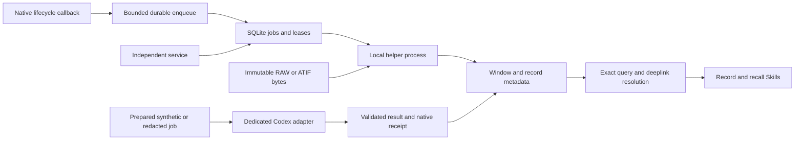

> Package reference from `docs/architecture.md`. Run repository-relative examples from a selected source or release directory; installed CLI commands use the installed executable.

# Recording and using task windows

The recorder is a local control plane. The helper parses explicitly selected
sources. Model adapters operate on separately prepared inputs. Native source
history and authentication remain owned by their original clients.

SQLite is application storage with explicit correlation metadata. It is not an
OpenTelemetry collector or a standard OTel SQLite backend. Export, retention and
collector deployment retain separate interfaces and acceptance requirements.

## Native callbacks

The installed Codex release has short SessionEnd/Interrupt deadlines and cancels
unfinished asynchronous hooks when a session ends. Callback work therefore stops
at bounded local admission or cached reads; model work never runs in a callback.
Source acknowledgement, durable admission, extraction completion and a useful
checkpoint remain separate statuses.

Codex SessionStart/UserPromptSubmit can carry cached additionalContext. PostCompact
can trigger work, while SessionStart with compact source is the supported recall
injection point in the inspected release. Stop is a turn-completion hook, not a
before-turn hook. v0.1 Stop is advisory; no fresh synchronous reviewer gate is
claimed. Existing project/Goal gates keep their independent authority.

Explicit bindings select the master session, client/profile, task and source roots.
Observer/worker sessions are inert. Live binding begins at the current complete
record boundary by default; historical replay is explicit. Hook-time byte ceilings
prevent delayed workers from attributing future source bytes to an earlier window.
Native hooks without stable delivery IDs need source-cursor-aware coalescing;
identical callback text alone cannot distinguish later windows in the same turn.

## Jobs and service lifetime

The service is explicitly started, queried and stopped. Hooks never start it.
The deterministic worker pool defaults to two workers and is capped at 32. Leases
and generation tokens fence stale workers; retries are explicit and retain prior
errors. Queue and query limits are part of the interface rather than hidden prompt
assumptions. Measure callback latency under the intended load; asynchronous work
still consumes host resources and does not have zero cost.

An optional model job owns a Codex App Server stdio child with an isolated persistent
authentication home and a fresh persisted native thread. v0.1 uses per-job process
isolation. A resident multi-job supervisor, automatic semantic fan-out and stronger
native gate policies require their own tested lifecycle and cost controls.

## Retrieval and continuity

Use stable record/window/event IDs and the selected store's deeplinks. Resolve the
metadata, then verify an explicitly authorized source slice before content access.
Do not follow arbitrary URI schemes, infer native IDs from filenames or equate
matching client-native, ATIF run/document and OTel strings.

Context packs are derived views. They retain source selectors and omissions,
protect call/result pairs and mandatory constraints, and leave original history
unchanged. A relevance or retention score is not a deletion proof or task reward.
Prepared external model inputs are synthetic or deliberately redacted; real RAW
and private dataset material stay local.

Formal task_turns_checkpoint events bind already sealed owner checkpoint and
lineage bytes. Imported event envelopes and observed windows do not independently
prove full schema validation, authentic source content or completed task acceptance.
Consumers inspect the recorded verification level before using a pointer.

See [the helper interface](helper-protocol.md), [model runtime](app-server-runtime.md)
and [dedicated authentication](authentication.md) for executable boundaries.
